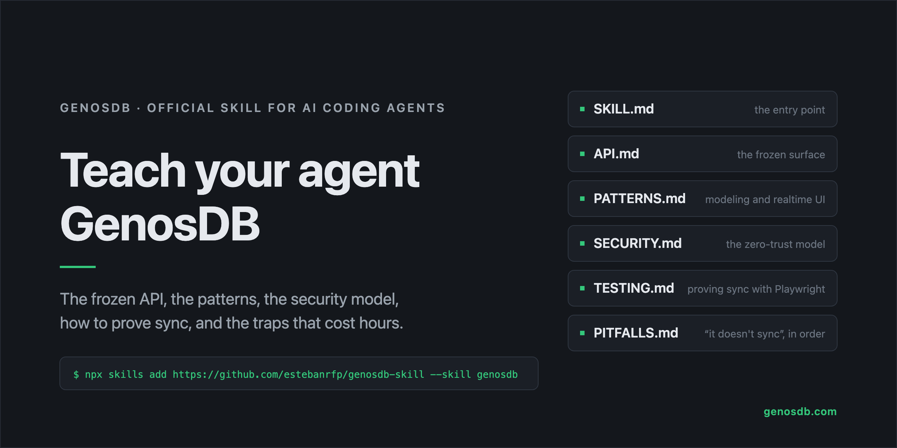

# genosdb-skill



The official skill for building applications on [GenosDB](https://github.com/estebanrfp/gdb) — the serverless, peer-to-peer graph database for the browser with a zero-trust Security Manager — for AI coding agents that support the Skills format (Claude Code, Cursor, and others).

It gives the agent what it cannot get from a closed-source engine: the frozen API surface, the data-modeling and realtime-UI patterns, the security model, how to prove peer-to-peer sync in tests, and how to diagnose "it doesn't sync". Everything in it is derived from the public documentation and the engine's typings, and it ships in the same commit as the engine, so it cannot drift from the version it describes.

## Install

```bash
npx skills add https://github.com/estebanrfp/genosdb-skill --skill genosdb --global
```

Drop `--global` to install it for the current project only. See `npx skills --help`.

## Files

| file | what it holds |
|---|---|
| `skills/genosdb/SKILL.md` | the entry point: what GenosDB is, the one boot call, the ten rules that prevent the usual disasters, when GenosDB is the wrong tool, how to check the bundle against its specification, and which file to read for what |
| `skills/genosdb/API.md` | the frozen surface — `gdb()` and its options, nodes and writes, reads and the query language, `db.room` channels and events, `db.sm` (identity, roles, ACLs, encrypted records, signed values, governance), the Fallback Server |
| `skills/genosdb/PATTERNS.md` | modeling, realtime UI, pagination, ordered lists, presence, the reference example for each application shape, layout rules, the shipping checklist, bundling |
| `skills/genosdb/SECURITY.md` | the threat model, the constitution, roles, ownership and ACLs, cryptographic confidentiality, passkeys, signed channel values, governance, and five things never to do |
| `skills/genosdb/IDENTITY.md` | the identity door: the dialog and its modes, the three phases drawn from the security state, the phrase, the four actions, the identity view and the session chip, passkeys and resume |
| `skills/genosdb/TESTING.md` | proving sync with Playwright: one browser context per peer, a fresh room per test, local discovery, no sleeps, sentinels, transport asserted with `getStats()`, passkeys headless, partitions, skewed clocks |
| `skills/genosdb/PITFALLS.md` | "it doesn't sync" in order, and the traps that cost hours |

## Sources of truth

The skill compresses and points at, in order of authority: `types/index.d.ts` in the `genosdb` package, the [documentation index](https://github.com/estebanrfp/gdb/blob/main/docs/index.md), [CRYPTOGRAPHY.md](https://github.com/estebanrfp/gdb/blob/main/CRYPTOGRAPHY.md) and [SECURITY.md](https://github.com/estebanrfp/gdb/blob/main/SECURITY.md), the [CHANGELOG](https://github.com/estebanrfp/gdb/blob/main/CHANGELOG.md), and the [examples](https://github.com/estebanrfp/gdb/blob/main/docs/genosdb-examples.md). When the skill and a newer engine disagree, the CHANGELOG wins.

## Versioning

The source of the skill lives beside the engine and is published here with every release. When it and the engine you run disagree, the CHANGELOG wins.

## Contributing

Corrections and additions are welcome as pull requests here or as [GitHub Discussions](https://github.com/estebanrfp/gdb/discussions) on the main repository. Keep the register: precise, source-backed, no invented API.

## License

MIT — see [LICENSE](LICENSE).

## Author

Esteban Fuster Pozzi ([@estebanrfp](https://github.com/estebanrfp)) - Full Stack JavaScript Developer
